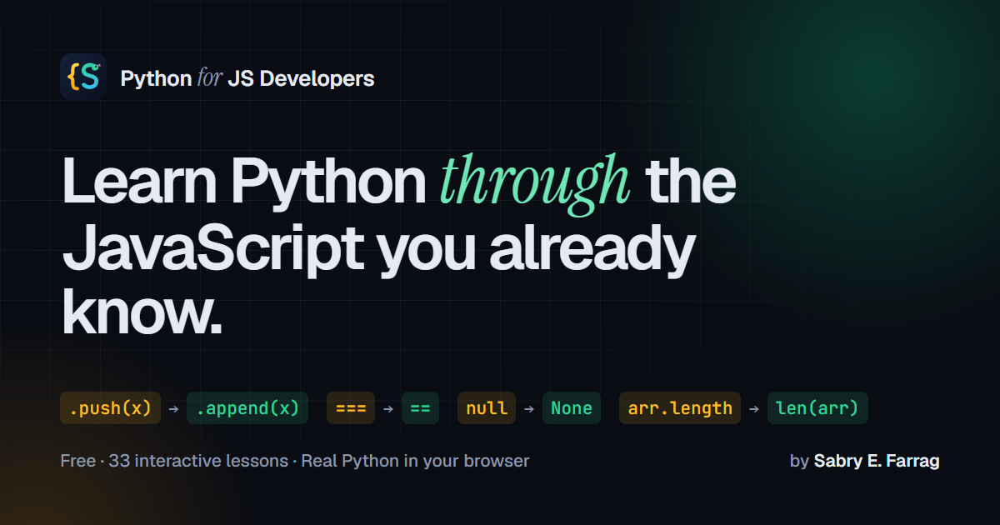

<div align="center">



# Python for JavaScript Developers

**A free, interactive Python course for JavaScript and TypeScript developers.**
Learn Python by mapping it to what you already know: side-by-side JS → Python lessons, the gotchas that trip up JS devs, and exercises that run **real Python in your browser** (no install).

[**▶ Start learning**](https://gatem.github.io/Python-For-Javascript-Developers/) · [Curriculum](#curriculum) · [How it works](#how-exercises-are-checked)

Created by **[Sabry E. Farrag](https://www.linkedin.com/in/sabry-elsayed)**

</div>

## What's inside

33 lessons in 13 modules, from first steps to professional tooling. The course targets Python 3.12+, and your code runs on Python 3.14 in the browser via [Pyodide](https://pyodide.org).

| Tier | Modules |
|---|---|
| 🌱 Foundations | Syntax Bridge · Data Structures · Loops & Iteration |
| 🐍 Core Python | Functions · Gotchas & Pitfalls · OOP · Modules & Errors |
| ⚡ Professional | File I/O · Generators & Context Managers · Modern Python · Async & Testing |
| 👑 Mastery | Pythonic Patterns · Ecosystem & Tooling (venv, pip, uv, ruff) |

Each lesson has:

- **An explanation** written for JS developers ("this is `Array.push`, but…")
- **A quick-reference table** of JS → Python equivalents
- **Heads-up tips** for the mistakes everyone makes
- **Side-by-side JS and Python code**
- **An exercise** with a hint, a reference answer, and hidden tests that actually run your code

Other features:

- **Notes**: write notes per lesson, or select lesson text to quote it.
- **Saved progress**: progress and code are stored in your browser.
- **Daily streaks.**
- **Deep links**: every lesson has its own URL (for example `/learn/oop/classes/`), pre-rendered so it loads fast and is indexed by search engines.
- **Light and dark themes**: follows your system setting, with a toggle in the header.
- **Syntax highlighting**: in the examples and in the editor as you type.
- **Works on any screen**: from phones to wide monitors.

## Curriculum

| Level | Module | Lessons |
|---|---|---|
| Foundations | **Syntax Bridge** | [Variables & Types](https://gatem.github.io/Python-For-Javascript-Developers/learn/syntax/variables/) · [Strings & f-strings](https://gatem.github.io/Python-For-Javascript-Developers/learn/syntax/strings/) · [Numbers & Math](https://gatem.github.io/Python-For-Javascript-Developers/learn/syntax/numbers/) · [Conditions & Truthiness](https://gatem.github.io/Python-For-Javascript-Developers/learn/syntax/conditionals/) |
| Foundations | **Data Structures** | [Lists (= Arrays)](https://gatem.github.io/Python-For-Javascript-Developers/learn/collections/lists/) · [Dictionaries (= Objects)](https://gatem.github.io/Python-For-Javascript-Developers/learn/collections/dicts/) · [Tuples & Sets](https://gatem.github.io/Python-For-Javascript-Developers/learn/collections/tuples-sets/) |
| Foundations | **Loops & Iteration** | [Loops & Control Flow](https://gatem.github.io/Python-For-Javascript-Developers/learn/loops/loops/) · [Iteration Toolkit](https://gatem.github.io/Python-For-Javascript-Developers/learn/loops/iteration-tools/) |
| Core Python | **Functions** | [Function Basics](https://gatem.github.io/Python-For-Javascript-Developers/learn/functions/basics/) · [List Comprehensions](https://gatem.github.io/Python-For-Javascript-Developers/learn/functions/comprehensions/) · [Decorators](https://gatem.github.io/Python-For-Javascript-Developers/learn/functions/decorators/) |
| Core Python | **Gotchas & Pitfalls** | [None, is vs ==](https://gatem.github.io/Python-For-Javascript-Developers/learn/gotchas/none-is/) · [Scope, Closures & Traps](https://gatem.github.io/Python-For-Javascript-Developers/learn/gotchas/scope/) |
| Core Python | **OOP** | [Python Classes](https://gatem.github.io/Python-For-Javascript-Developers/learn/oop/classes/) · [Inheritance & ABCs](https://gatem.github.io/Python-For-Javascript-Developers/learn/oop/inheritance/) · [Dunder Methods](https://gatem.github.io/Python-For-Javascript-Developers/learn/oop/dunder/) |
| Core Python | **Modules & Errors** | [The Import System](https://gatem.github.io/Python-For-Javascript-Developers/learn/modules/imports/) · [Scripts & __main__](https://gatem.github.io/Python-For-Javascript-Developers/learn/modules/scripts/) · [Error Handling](https://gatem.github.io/Python-For-Javascript-Developers/learn/modules/errors/) |
| Professional | **File I/O & Data** | [File Operations](https://gatem.github.io/Python-For-Javascript-Developers/learn/fileio/files/) · [JSON & Regex](https://gatem.github.io/Python-For-Javascript-Developers/learn/fileio/json-regex/) |
| Professional | **Generators & Context Managers** | [Generators & Iterators](https://gatem.github.io/Python-For-Javascript-Developers/learn/generators/generators/) · [Context Managers](https://gatem.github.io/Python-For-Javascript-Developers/learn/generators/context-managers/) |
| Professional | **Modern Python** | [Dataclasses](https://gatem.github.io/Python-For-Javascript-Developers/learn/modern/dataclasses/) · [Type Hints](https://gatem.github.io/Python-For-Javascript-Developers/learn/modern/typehints/) · [Pattern Matching & Enums](https://gatem.github.io/Python-For-Javascript-Developers/learn/modern/pattern-match/) |
| Professional | **Async & Testing** | [Async/Await](https://gatem.github.io/Python-For-Javascript-Developers/learn/async-testing/async/) · [Testing with pytest](https://gatem.github.io/Python-For-Javascript-Developers/learn/async-testing/testing/) |
| Mastery | **Pythonic Patterns** | [Idiomatic Python](https://gatem.github.io/Python-For-Javascript-Developers/learn/pythonic/patterns/) · [Modern Idioms](https://gatem.github.io/Python-For-Javascript-Developers/learn/pythonic/modern-idioms/) |
| Mastery | **Ecosystem & Tooling** | [The Standard Library](https://gatem.github.io/Python-For-Javascript-Developers/learn/ecosystem/stdlib/) · [Project Setup & Tooling](https://gatem.github.io/Python-For-Javascript-Developers/learn/ecosystem/tooling/) |

## How exercises are checked

1. **Static checks** catch JS habits (`console.log`, `===`, `null`, `.push()`, braces…) and make sure you used the technique the lesson teaches. Comments are ignored, so an answer typed into a comment doesn't count.
2. **Your code runs** in Pyodide inside a Web Worker, so the page never freezes. Runs are stopped after 10 seconds, which catches infinite loops.
3. **Hidden tests** (plain Python `assert`s) check what your code actually does. Any correct solution passes, not only the one in the reference answer.

## Run locally

```bash
npm install
npm run dev          # http://localhost:5173
```

| Script | What it does |
|---|---|
| `npm run dev` | Dev server with hot reload |
| `npm run build` | Production build into `dist/`, with every page pre-rendered for SEO |
| `npm run preview` | Serve the production build locally |
| `npm run lint` | ESLint (including accessibility rules) |
| `npm test` | Fast unit tests |
| `npm run test:exercises` | Runs **every** reference answer and its hidden tests in real Python (slower; filter with `-- -t "oop"`) |

## Deploying to GitHub Pages

The repo includes `.github/workflows/deploy.yml`, which lints, tests, builds and deploys on every push to `main`.

1. Push the repo to GitHub.
2. In **Settings → Pages**, set **Source** to **GitHub Actions**.
3. Push to `main`, or run the workflow manually from the **Actions** tab.

The workflow sets `BASE_PATH` to `/<repo-name>/`, so the site works from any repository name. `npm run build` pre-renders every page to static HTML (title, description, canonical URL, Open Graph and schema.org data) and writes `sitemap.xml`. If you fork the project, update `SITE_URL` in `src/config.js`.

## Adding or editing lessons

Lessons live in `src/data/modules/*.js`. A lesson looks like this:

```js
{
  id: "my-lesson",              // kebab-case, never change it after publishing (progress is keyed on it)
  title: "My Lesson",
  content: "Paragraphs separated by \n\n",
  keyDiffs: [{ js: "arr.push(x)", py: "arr.append(x)", note: "..." }],
  tips: ["..."],
  jsCode: "// JavaScript example",
  pyCode: "# Python example",
  exercise: {
    question: "What to do",
    prompt: "Optional starter / JS code to convert",
    hint: "A nudge, not the answer",
    answer: "reference solution",
    setup: "optional Python run before the learner's code",
    tests: "assert result == 42, 'helpful message'",  // runs after the learner's code; can use __output__ (stdout) and __source__
    output: "optional exact expected stdout",
    checks: (code) => [has(code, /\.append\(/, "Use .append()")],
  },
}
```

Run `npm run test:exercises` after editing. It confirms that every reference answer passes its tests and that the tests reject an empty solution.

**Ids are permanent.** They are part of each lesson's URL, and learners' progress, saved code and notes are keyed on `module-id/lesson-id`. If you ever have to rename one, add a mapping in `src/lib/migrate.js`.

## Tech

React 19, Vite, Tailwind CSS 4 (design tokens for light and dark themes), lucide icons, Pyodide (loaded from the jsDelivr CDN on first run), Vitest, and ESLint with `jsx-a11y`.

## Author

**Sabry E. Farrag**: [LinkedIn](https://www.linkedin.com/in/sabry-elsayed)

## License

[MIT](LICENSE) © Sabry E. Farrag
